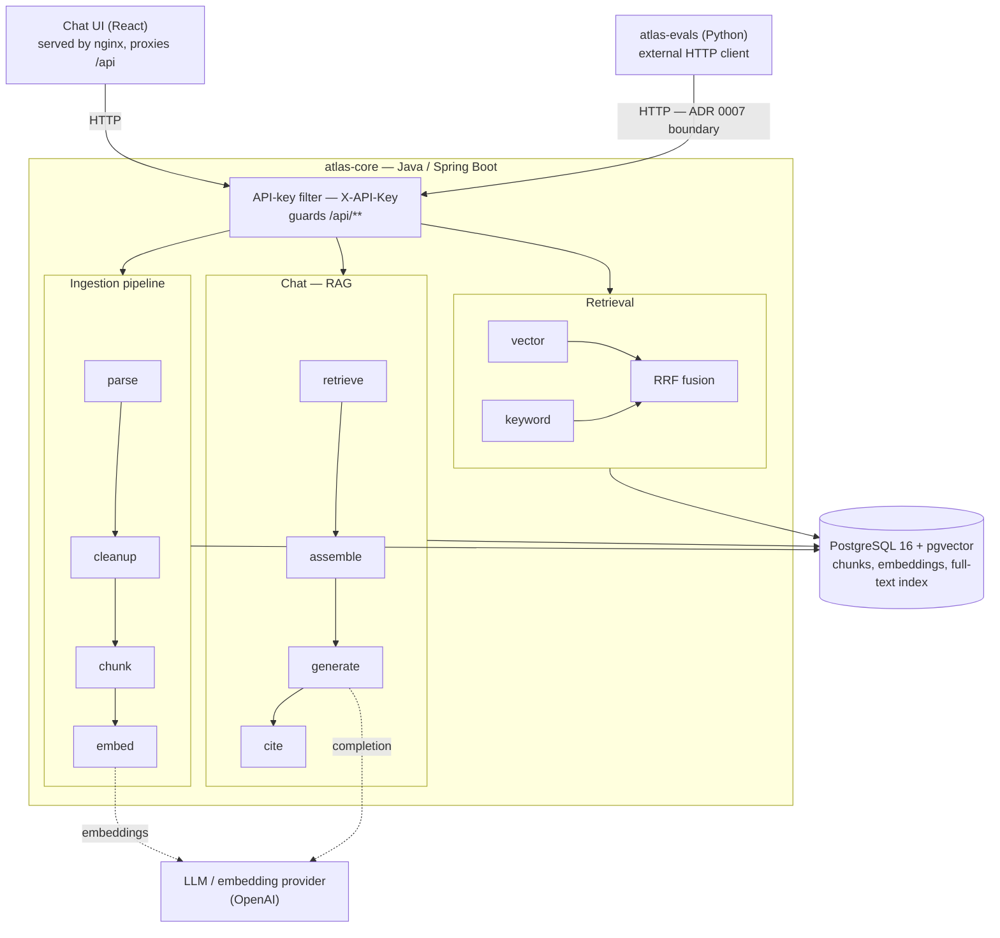

# Atlas v1

**Atlas** is an open-source Retrieval-Augmented Generation (RAG) platform built on Java and
Spring, paired with a Python evaluation harness and a set of forward-deployed engineering (FDE)
playbooks for taking it into production at a customer site.

Atlas exists because most RAG stacks are prototyped in Python and then rebuilt from scratch to
meet enterprise requirements around observability, type safety, and deployment discipline. Atlas
starts from the JVM side of that gap: a Spring Boot service for ingestion, retrieval, and
generation, with a Python-based quality bar (`atlas-evals`) and a documented deployment process
(`atlas-fde`) so quality isn't just implicit in the code — it's measured and repeatable.

## What it is

- A Java/Spring Boot service that implements the core RAG pipeline: document ingestion, chunking,
  embedding, vector retrieval, and grounded generation.
- A Python evaluation harness that measures retrieval and generation quality against golden
  datasets, independent of the core service's implementation language.
- A set of FDE playbooks and templates that codify how a deployment engineer takes Atlas from
  zero to a live customer instance, with an eval-based sign-off gate before go-live.
- A monorepo, not a framework — `atlas-core`, `atlas-evals`, and `atlas-fde` are independently
  useful and loosely coupled, communicating over HTTP rather than shared code.

## What v1 includes

- **RAG pipeline** (`atlas-core`) — ingest → embed → retrieve → generate, exposed over a REST API.
- **Hybrid retrieval** — vector search (pgvector) and PostgreSQL full-text search, fused with
  Reciprocal Rank Fusion (RRF), rather than vector-only similarity.
- **SSE streaming chat** — token-level generation streamed to the client over Server-Sent Events,
  with inline citations back to source chunks.
- **Minimal React chat UI** — a lightweight chat page for interacting with Atlas and inspecting
  citations, alongside the REST API.
- **API-key-protected endpoints** — a static `X-API-Key` header is required on all `/api/**` routes
  (`ATLAS_API_KEY`, env-only). Actuator health stays open. If `ATLAS_API_KEY` is unset/blank, auth is
  **disabled** with a startup WARN — deliberate, so local dev, CI, and the quickstart run friction-free
  while the production posture (set the key) is explicit rather than a baked-in default. Not OAuth2 —
  that's v2. See `ApiKeyAuthFilter`.
- **Pluggable LLM/embedding provider** — abstracted behind a thin client interface in `atlas-core`.
- **Offline eval suite** (`atlas-evals`) — deterministic retrieval metrics (doc-hit, page-hit, MRR)
  and citation-grounding / abstention checks against golden Q&A datasets, plus `report` and
  `compare` commands, driven from Python against `atlas-core`'s HTTP API. Includes `atlas-eval
  doctor`, a one-command deployment diagnostic.
- **Reference deployment** (`atlas-fde/demo-vertical.md`) — the EU digital-regulation knowledge
  assistant, documented as the reference vertical: corpus, measured baseline, demo script, and how
  an FDE clones it for a customer corpus.
- **FDE playbooks** (`atlas-fde`) — onboarding runbook and deployment checklist template covering
  prerequisites, ingestion, eval sign-off, go-live, and rollback.
- **Docker deployment** (`docker`) — a one-command local `docker-compose.yml` and a
  production-leaning `docker-compose.prod.yml` (pinned images, required secrets, healthchecks,
  nginx-served UI), with an operator [runbook](atlas-fde/runbook.md).
- **CI** — build, test, and lint/format checks for the Java, Python, and React modules on every
  push/PR, plus a mock-Atlas eval smoke run and gitleaks secret scanning.

## What is not in v1

These are explicit non-goals for this release, not oversights — they're candidates for v2+:

- **Multi-tenant isolation.** v1 assumes one deployment per customer, not a shared multi-tenant
  service.
- **Managed/hosted control plane.** There is no SaaS control plane, admin UI, or usage metering —
  Atlas is deployed and operated by whoever runs it.
- **Online/production evals.** `atlas-evals` currently runs offline against golden datasets, not
  as a continuous production quality monitor.
- **Re-ranking and query rewriting.** Retrieval is hybrid (vector + full-text via RRF) but stops
  there — no cross-encoder re-ranking or LLM-based query rewriting in v1.
- **Kubernetes.** Deployment targets are documented for single-host/Docker Compose environments;
  no Helm charts or k8s manifests ship in v1.
- **OAuth2.** v1 uses simple API-key auth in front of `atlas-core`; a full OAuth2/OIDC flow is not
  implemented.

## Architecture



`atlas-evals` reaches `atlas-core` only over the same public HTTP API as any other client — the
[ADR 0007](docs/adr/0007-monorepo-http-boundaries.md) boundary that keeps the measurements honest.

- **atlas-core** (Java/Spring Boot) owns the pipeline above, fuses vector and full-text retrieval
  with RRF, streams generation over SSE, and exposes it over an API-key-protected HTTP API.
- **vector store** is PostgreSQL 16 + pgvector — v1 does not treat this as swappable per
  deployment, since the embedding dimension couples the schema to the embedding model in use
  (see `docs/adr` for that decision and its implications).
- **chat UI** is a minimal React page that talks to `atlas-core` over the same HTTP API, rendering
  streamed responses and their citations.
- **atlas-evals** (Python) is an external client of `atlas-core` — it has no in-process dependency
  on the Java code, so it can evaluate any running instance, local or remote.
- **atlas-fde** is process and documentation, not a running component — it governs how the above
  gets deployed and validated at a customer site.

See [`docs/architecture/overview.md`](docs/architecture/overview.md) for more detail and
[`docs/adr`](docs/adr) for the reasoning behind key design decisions.
[`docs/retrieval-quality.md`](docs/retrieval-quality.md) shows the three retrieval engines
compared on real queries — and why hybrid RRF is the default — with reproducible commands.

## Quickstart

> **Prerequisites:** Docker (with the Compose v2 plugin) and Git. Path B additionally needs
> **JDK 21** (the build enforces it) and [uv](https://docs.astral.sh/uv/). Corpus ingestion needs
> `curl` and `jq`.

```bash
git clone https://github.com/ataulnasar/atlas.git
cd atlas
cp docker/.env.example docker/.env      # at minimum set POSTGRES_PASSWORD
```

For grounded, **cited** answers (not just keyword retrieval), set `SPRING_AI_OPENAI_API_KEY` in
`docker/.env` before starting — it powers both embeddings and generation. Leaving it empty is fine
to try retrieval, but chat will report generation disabled.

Before starting the stack, check nothing else already holds the ports it binds — Postgres `5432`
and atlas-core `8080` (the prod profile also uses `80`):

```bash
docker ps --format '{{.Names}}\t{{.Ports}}' | grep -E '5432|8080' || echo "ports free"
```

(If a port is taken, either stop the other container or remap Atlas — see `ATLAS_CORE_PORT` /
`POSTGRES_PORT` in [`docker/README.md`](docker/README.md).)

### Path A — everything in Docker (recommended)

```bash
docker compose -f docker/docker-compose.yml up -d          # Postgres + atlas-core
curl -fsS http://localhost:8080/actuator/health            # {"status":"UP"} (wait ~10s on first boot)
```

atlas-core is now on `http://localhost:8080`. Rebuild after code changes with `… up -d --build`.

### Path B — hybrid dev (DB in Docker, app on host)

Run only the database in a container and the app on your host — for a debugger, hot reload, or
faster iteration. **Do not run both the containerized app and the host app on `:8080`.**

```bash
# 1. Start ONLY Postgres (not the app):
docker compose -f docker/docker-compose.yml up -d postgres
#    If you already ran Path A, stop the containerized app first so :8080 is free:
#    docker compose -f docker/docker-compose.yml stop atlas-core

# 2. Wire the host app to the containerized DB. The app's built-in datasource default is
#    user/password "atlas"; export the password you actually set in docker/.env:
export SPRING_DATASOURCE_URL=jdbc:postgresql://localhost:5432/atlas
export SPRING_DATASOURCE_USERNAME=atlas
export SPRING_DATASOURCE_PASSWORD='<your POSTGRES_PASSWORD from docker/.env>'
export ATLAS_STORAGE_PATH=./data/documents
#    Optional — enable generation and require the API key on the host app too:
#    export SPRING_AI_OPENAI_API_KEY=sk-...
#    export ATLAS_API_KEY='<a value your clients will send as X-API-Key>'

# 3. Run the app on the host:
cd atlas-core
./mvnw spring-boot:run
```

### Ingest a corpus and evaluate

With atlas-core running (either path):

```bash
# 1. Fetch and ingest the demo EU-regulation corpus.
#    ingest.sh sends ATLAS_API_KEY as X-API-Key when it's set in your environment.
./corpus/download.sh
ATLAS_BASE_URL=http://localhost:8080 ./corpus/ingest.sh

# 2. Diagnose the deployment, then evaluate it:
cd atlas-evals
uv sync
uv run atlas-eval doctor --base-url http://localhost:8080 --fix-hints
uv run atlas-eval run --dataset mini-golden --base-url http://localhost:8080
```

Full setup instructions live in each module's README: [`atlas-core`](atlas-core/README.md),
[`atlas-evals`](atlas-evals/README.md), [`docker`](docker/README.md).

## Deploy

For a single-host production-leaning deployment, use the compose profile in
[`docker/docker-compose.prod.yml`](docker/docker-compose.prod.yml):

```bash
cd docker
# set POSTGRES_PASSWORD, ATLAS_API_KEY, SPRING_AI_OPENAI_API_KEY in .env — all required
docker compose -f docker-compose.prod.yml up -d --build
```

It pins images, keeps the database off the host network, **requires** the secrets above (startup
aborts loudly if any is missing — there is no keyless fallback), healthchecks and rate-limits every
service, and serves the built React UI behind nginx (which reverse-proxies `/api` to `atlas-core`,
so the whole app is one same-origin ingress on `:80`). Backup/restore and the full rationale are in
the [`docker` README](docker/README.md#deploy-production-profile). The reference deployment this
profile is meant to run is documented in [`atlas-fde/demo-vertical.md`](atlas-fde/demo-vertical.md),
and [`atlas-fde/runbook.md`](atlas-fde/runbook.md) is the operator's guide (install, upgrade,
backup/restore, rollback, troubleshooting) — with `atlas-eval doctor` as the first diagnostic step.

## Roadmap

Beyond v1, in rough priority order:

- **Retrieval quality** — re-ranking, query rewriting.
- **Online evals** — continuous quality monitoring against live production traffic.
- **Multi-tenant support** — shared-service deployment model.
- **UI beyond the minimal chat page** — an admin/debugging frontend for ingestion status and
  query tracing.
- **Managed control plane** — hosted/managed offering, once the self-hosted model is proven out.

Roadmap items are tracked as GitHub issues; see the repository's issue tracker for current status.

The working backlog for getting to v1 itself is tracked in [`docs/plan.md`](docs/plan.md).

## Repository layout

| Path          | Purpose                                                             |
|---------------|----------------------------------------------------------------------|
| `atlas-core`  | Java/Spring Boot RAG service — ingestion, retrieval, orchestration |
| `atlas-ui`    | React + Vite chat page — streaming answers with clickable citations  |
| `atlas-evals` | Python harness for offline RAG quality evaluation (metrics + doctor)  |
| `atlas-fde`   | Forward-deployed engineering playbooks and deployment templates      |
| `docker`      | Local dev and reference deployment compose files                    |
| `docs`        | Architecture notes and Architecture Decision Records (ADRs)          |

## Contributing

Issues and pull requests are welcome. Since Atlas is early and its interfaces are still moving,
please open an issue to discuss substantial changes before submitting a PR.

For AI-assisted development, see [CLAUDE.md](CLAUDE.md) — guardrails for AI agents, including
never touching local secrets (`docker/.env`).

## License

Apache License 2.0 — see [LICENSE](LICENSE).
